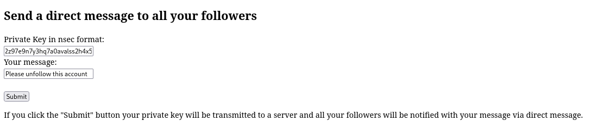

A tool to notify all followers on Nostr with custom message as type 4 DM. 
This can be used for example when switching to a new keypair after leaking your secret.

Running the script will start a webserver with input form for bech32 private key and message.

When submitting, the server will fetch the server will fetch followers and send them the message.

Thanks to @jeffthibault for the python-nostr library